# Построяване на честотна таблица 
### Курсов проект

_Разпределени софтуерни архитектури, 
летен семестър 2023/2024_

_Изготвил:_ Теодор Костадинов, 4MI0600097, СИ, 3 курс

## 1. Постановка на задачата

### 1.1 Описание на задачата

Задачата се състои в разработването на програма, която получава за вход текстов файл и пресмята колко често се среща всеки символ във файла. Този процес е известен като построяване на честотна таблица. Честотната таблица е основополагащ елемент за множество алгоритми за компресия на данни, включително алгоритъма на Хъфман.

### 1.2 Цел на задачата

Основната цел е да се създаде програма, която ефективно и точно може да изчисли честотата на символите в даден текстов файл. Програмата трябва да бъде оптимизирана за работа с големи файлове и да използва паралелна обработка за подобряване на производителността.

### 1.3 Алгоритъм на Хъфман

Алгоритъмът на Хъфман е метод за компресия на данни без загуба, който използва честотната таблица за изграждане на бинарно дърво за кодиране на символите. Символите с по-висока честота се кодират с по-кратки битови последователности, а символите с по-ниска честота - с по-дълги. Това води до намаляване на общия размер на данните.

### 1.4 Изисквания към програмата

1. **Вход и изход**:
    - Програмата трябва да приема като вход текстов файл.
    - Програмата трябва да изчислява и отпечатва честотната таблица, показвайки колко пъти се среща всеки символ във файла.

2. **Ефективност**:
    - Програмата трябва да бъде способна да обработва големи файлове.
    - Използването на паралелна обработка е препоръчително за подобряване на производителността.

3. **Точност**:
    - Честотната таблица трябва да бъде коректно изчислена, като се вземат предвид всички символи във файла, включително специални символи и интервали.

### 1.5 Задачи за изпълнение

1. **Четене на файла**:
    - Разработване на механизъм за четене на входния текстов файл символ по символ, за да се осигури точност при изчисляването на честотите на символите.

2. **Изчисляване на честотите**:
    - Създаване на структура от данни (например хеш-таблица), в която да се съхранява броят на срещанията на всеки символ.

3. **Паралелна обработка**:
    - Разделяне на файла на части, които да се обработват паралелно от различни нишки, с цел ускоряване на процеса.
    - Синхронизиране на достъпа до глобалната честотна таблица, за да се избегнат конфликти при актуализиране.

4. **Отчитане и представяне на резултатите**:
    - Обединяване на резултатите от всички нишки и извеждане на окончателната честотна таблица.
    - Показване на времето за изпълнение на програмата и броя използвани нишки.

<div class="page"/>

## 2. Цел на проекта
Целта на проекта е да изследва ефективността на 3 различни решения, използващи многонишково програмиране за решаване на поставената задача в точка 1. Всяко решение е имплементирано с Java код, който може да се изпълнява с променливи параметри - входен файл, брой нишки, тих режим, и в едно от решенията - големина на четящия прозорец. Времето за изпълнението на програмата с множество параметри се записва чрез помощен скрипт и се изчисляват метриките в точка 2.2.

Трите вида разглеждани решения са:
- "Наивно" решение - Всяка нишка чете по един символ от входния файл и увеличава честота на символа в споделена колекция.
-  Решение "Изчитане наведнъж" - Входният файл се зарежда в паметта, след което всяка нишка взима пропорционално по големина парче и изчислява честота на символите.
-  Решение "Изчитане на парчета" - Всяка нишка чете парче от входния файл и изчислява честота на символите, след което взима следващото парче от входния файл.

### 2.1 Изпълнение на решение

- Всяко решение е написано на Java.
- За да се стартира решението, изпълнете `javac ExampleProgram.java`, след което `java ExampleProgram` стартира програмата без никакви параметри.
- Програмата приема следните параметри:
    - `-f <input_file>` - Задава входния файл на програмата, текстът, чиито символи ще бъдат анализирани за честота на срещане. Задължителен параметър при изпълнение на програмата.
    - `-t <number_of_threads>` - Задава броят нишки, които паралелно ще изчисляват броя срещания на всеки символ. Работата на всяка една отделна нишка варира в решенията. Задължителен параметър при изпълнение на програмата.
    - `-q` - Задава тих режим на работа на програмата, заглушават се всички съобщения свързани с индивидуалните нишки. Показва се само финалното съобщение за общо време на работа на програмата и общ брой нишки.  Опционален параметър при изпълнение на програмата.
    - `-w <output_file>` - Задава местоположението на изходния файл, съдържащ честота на всеки символ от входния файл. Без задаване на този параметър, изходният файл няма да бъде запаметен. Опционален параметър при изпълнение на програмата.
    - `-c <number_of_bytes>` - Наличен в третото решение. Задава колко голям блок от данни да прочете всяка нишка и обработи. След приключване на блока, нишката ще прочете следващия непрочетен блок от входния файл, ако има такъв. Задължителен параметър при изпълнение на съответното решение.
- Програмата извежда подходящи съобщения на различните етапи от работата си, както и
времето отделено за изчисление;

- Примерни съобщения:
    ```
    "Thread-<num> started.",
    "Thread-<num> stopped.",
    "Thread-<num> execution time was (millis): <num>",
    "Threads used in current run: <num>",
    "Total execution time for current run (millis): <num>".
    ```

### 2.2 Метрики на тестовете

- **#**: Номер на извършения тест в групата.
  
- **p**: Брой паралелни нишки, които се използват за обработка на файла в извършения тест.

- **G**: Грануларността на извършения тест.

- **Tp(1), Tp(2), Tp(3)**: Времето за изпълнение (в милисекунди) за всеки от трите тестове при дадения брой нишки p.

- **Tp**: Минималното време за изпълнение от всички тестове за дадения брой нишки p.

- **Sp**: Ускорение спрямо единична нишка. То е изчислено като отношение на времето за изпълнение с една нишка (Tp(1)) спрямо времето за изпълнение с p нишки (Tp). Ускорението демонстрира ефективността на паралелизма и колко добре програмата използва ресурсите при увеличаване на броя на нишките.

- **Ep**: Ефективност на паралелизма. Това е измерване на ефективността на паралелизма и се изчислява като Sp / p. Ефективността над 1 показва, че програмата е в състояние да използва ресурсите ефективно при увеличаване на броя на нишките, докато стойности под 1 могат да означават загуба на ресурси за синхронизация и други разходи.

### 2.3 Извличане на резултатите

Резултатите се извличат чрез Python скрипт - "extract_results.py" и "extract_results_chunks.py". Скриптът изпълнява конкретно решение с конкретен входен файл при списък от зададени стойности за брой нишки. Всяка зададена стойност за брой нишки се използва, за да се тества времето за изпълнението на програмата 3 пъти. Python скриптът изчислява най-ниската времева стойност, както и автоматично пресмята ускорение и ефективност от описаните в точка 2.2.

Основните параметри, които се променят във файла са:
- *INPUT_FILE_SIZE* - задава големината на входния файл, който ще бъде подаван на програмата. Входните файлове са предварително създадени чрез bash скрипта `head -c <FILE_SIZE>MB </dev/urandom >inputs/<FILE_SIZE>`, където *<FILE_SIZE>* е желаният размер на файла в MB.
- *SOLUTION_DIR* - Директорията, където се намира желаното решение.
- *THREAD_COUNTS* - Списък със стойностите за брой нишки, с които ще се изпълнява многократно програмата.

### 2.4 Характеристики на машините за тестове

| Parameters          | Home PC                                    | t5600.rmi.yaht.net                     |
|---------------------|--------------------------------------------|----------------------------------------|
| CPU Architecture    | 12th Gen Intel(R) Core(TM) i7-12800H (x86_64) | x86_64                              |
| Threads per core    | 1                                          | 2                                      |
| Cores per socket    | 14                                         | 8                                      |
| Sockets             | 1                                          | 2                                      |
| Total cores         | 14                                         | 16 (32 with HT)                        |
| Model name          | Intel(R) Core(TM) i7-12800H                | Intel(R) Xeon E5-2660 @ 2.20GHz        |
| CPU max MHz         | 2400                                       | 3000                                   |
| CPU min MHz         | 100                                        | 1200                                   |
| L1d cache           | 32 KB (per core)                           | 32 KB (per core)                       |
| L1i cache           | 32 KB (per core)                           | 32 KB (per core)                       |
| L2 cache            | 1152 KB                                    | 256 KB                                 |
| L3 cache            | 24576 KB                                   | 20480 KB                               |
| RAM Size            | 32.0 GB                                    | 62.7 GB                                |
| OS Version          | Windows 11 Enterprise                      | CentOS Linux release 7 (core)          |

<div class="page"/>

## 3. Изследване на "Наивното" решение

В този подход всяка нишка чете по един символ от входния файла и отчита срещането в споделената колекция за честота на символите.

#### 3.1 Описание на решението

1. **Четене на файла**: Всяка нишка чете по един символ от входния текстов файл, използвайки синхронизация чрез общ обект `fileLock`, който гарантира, че достъпът до файловете е синхронизиран и безопасен за многонишково изпълнение.

2. **Обновяване на честотната таблица**: След като символът е прочетен, той се добавя или увеличава броят си в споделената колекция `frequencyTable`. Тази операция също е синхронизирана, за да се избегнат конфликтите при достъп и актуализация на данните в таблицата.

3. **Използване на ExecutorService**: За паралелната обработка се използва `ExecutorService` с фиксиран брой нишки, които се инициализират в зависимост от броя на зададените нишки (`numThreads`). Всяка нишка се създава като инстанция на `HuffmanParallelReadOneByOne`, която е `Runnable`.

### 3.2 Имплементация на решението

Кодът, който всяка нишка изпълнява (_код 1_):

```java
@Override
public void run() {
    long startTime = System.currentTimeMillis();
    System.out.println("Thread-" + threadId + " started.");

    try {
        while (true) {
            int c;
            synchronized (fileLock) {
                c = reader.read();
            }
            if (c == -1) {
                break;
            }

            char character = (char) c;
            synchronized (frequencyTable) {
                frequencyTable.put(character, frequencyTable.getOrDefault(character, 0) + 1);
            }
        }
    } catch (IOException e) {
        e.printStackTrace();
    }

    long endTime = System.currentTimeMillis();
    System.out.println("Thread-" + threadId + " stopped.");
    System.out.println("Thread-" + threadId + " execution time was (millis): " + (endTime - startTime));
}
```

---
Кодът за паралелно изпълнение на програмата (_код 2_):

```java
private static void runMultiThreaded() {
    long startTime = System.currentTimeMillis();
    ExecutorService executor = Executors.newFixedThreadPool(numThreads);
    List<Future<?>> futures = new ArrayList<>();
    for (int i = 0; i < numThreads; i++) {
        HuffmanParallelReadOneByOne task = new HuffmanParallelReadOneByOne(i + 1);
        futures.add(executor.submit(task));
    }
    ...
```


### 3.3 Резултати от решението

---
Резултати от "Наивното" решение при четене на файл *25 MB*, машина "Home PC" (_таблица 1_):

| # | p | G | Tp(1) | Tp(2) | Tp(3) | Tp(min) | Sp | Ep |
|---|---|---|-------|-------|-------|----|----|----|
| 1  | 1  | 1  | 1226ms | 1201ms | 1223ms | 1201ms | 1.000000 | 1.000000 |
| 2  | 2  | 1  | 3526ms | 3400ms | 3530ms | 3400ms | 0.353235 | 0.176618 |
| 3  | 3  | 1  | 3133ms | 3742ms | 3512ms | 3133ms | 0.383339 | 0.127780 |
| 4  | 4  | 1  | 3641ms | 3417ms | 3559ms | 3417ms | 0.351478 | 0.087869 |
| 5  | 5  | 1  | 3536ms | 3548ms | 3490ms | 3490ms | 0.344126 | 0.068825 |
| 6  | 6  | 1  | 3649ms | 3707ms | 3506ms | 3506ms | 0.342556 | 0.057093 |
| 7  | 7  | 1  | 3758ms | 3712ms | 3530ms | 3530ms | 0.340227 | 0.048604 |
| 8  | 8  | 1  | 4243ms | 4197ms | 3936ms | 3936ms | 0.305132 | 0.038142 |
| 9  | 9  | 1  | 4116ms | 4420ms | 4017ms | 4017ms | 0.298979 | 0.033220 |
| 10 | 10 | 1  | 4090ms | 4152ms | 3971ms | 3971ms | 0.302443 | 0.030244 |
| 11 | 16 | 1  | 4293ms | 4236ms | 3971ms | 3971ms | 0.302443 | 0.018903 |
| 12 | 32 | 1  | 3961ms | 4472ms | 4384ms | 3961ms | 0.303206 | 0.009475 |
| 13 | 64 | 1  | 4700ms | 4631ms | 4687ms | 4631ms | 0.259339 | 0.004052 |
| 14 | 128 | 1  | 4505ms | 4830ms | 4937ms | 4505ms | 0.266593 | 0.002083 |
| 15 | 1024 | 1  | 6918ms | 6478ms | 7399ms | 6478ms | 0.185397 | 0.000181 |

Графика на времето от "Наивното" решение при четене на файл *25 MB*, машина "Home PC"
(_фигура 1_):

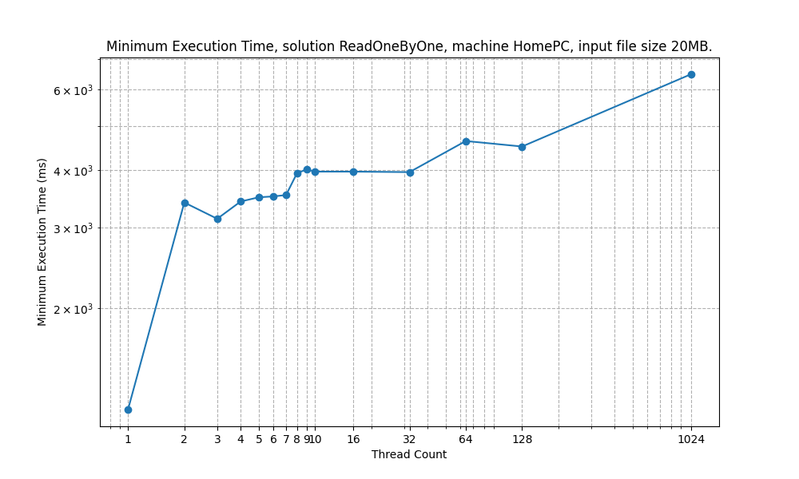

---

Резултати от "Наивното" решение при четене на файл *100 MB*, машина "Home PC" (_таблица 2_):

| # | p | G | Tp(1) | Tp(2) | Tp(3) | Tp(min) | Sp | Ep |
|---|---|---|-------|-------|-------|----|----|----|
| 1  | 1  | 1  | 9035ms | 9036ms | 8772ms | 8772ms | 1.000000 | 1.000000 |
| 2  | 2  | 1  | 28627ms | 29537ms | 25661ms | 25661ms | 0.341842 | 0.170921 |
| 3  | 3  | 1  | 28802ms | 25892ms | 26154ms | 25892ms | 0.338792 | 0.112931 |
| 4  | 4  | 1  | 32447ms | 37745ms | 34016ms | 32447ms | 0.270349 | 0.067587 |
| 5  | 5  | 1  | 34000ms | 30658ms | 29518ms | 29518ms | 0.297175 | 0.059435 |
| 6  | 6  | 1  | 30357ms | 28985ms | 31542ms | 28985ms | 0.302639 | 0.050440 |
| 7  | 7  | 1  | 31535ms | 31318ms | 31603ms | 31318ms | 0.280095 | 0.040014 |
| 8  | 8  | 1  | 29417ms | 30549ms | 30437ms | 29417ms | 0.298195 | 0.037274 |
| 9  | 9  | 1  | 31383ms | 37041ms | 36181ms | 31383ms | 0.279514 | 0.031057 |
| 10 | 10 | 1  | 32033ms | 28289ms | 27986ms | 27986ms | 0.313442 | 0.031344 |
| 11 | 16 | 1  | 32166ms | 32434ms | 29786ms | 29786ms | 0.294501 | 0.018406 |
| 12 | 32 | 1  | 32478ms | 30175ms | 29088ms | 29088ms | 0.301568 | 0.009424 |
| 13 | 64 | 1  | 33984ms | 35911ms | 33252ms | 33252ms | 0.263804 | 0.004122 |
| 14 | 128 | 1  | 34119ms | 32320ms | 30944ms | 30944ms | 0.283480 | 0.002215 |
| 15 | 1024 | 1  | 38123ms | 39321ms | 42229ms | 38123ms | 0.230097 | 0.000225 |

Графика на времето от "Наивното" решение при четене на файл *100 MB*, машина "Home PC"
(_фигура 2_):

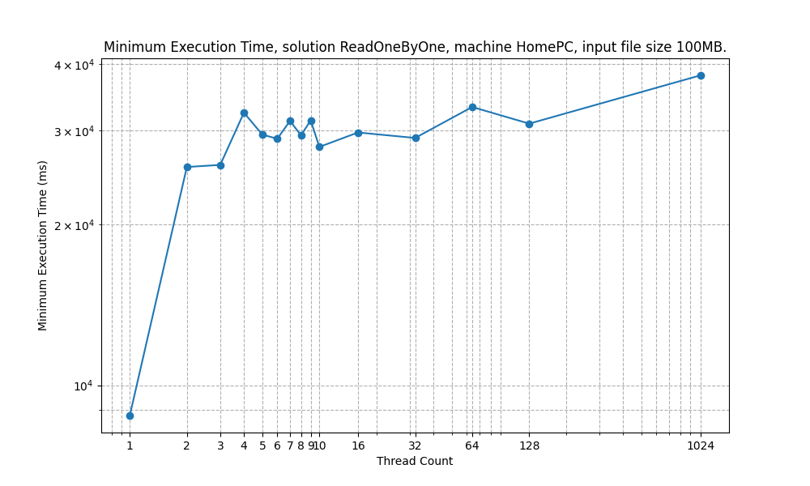

### 3.4 Анализ на получените резултати

Забелязва се, че с увеличаването на броя на нишките, времето за изпълнение на програмата също се увеличава. Това е обратно на желания ефект - да ускорим времето за изпълнение, чрез добавяне на паралелна обработка. Нежеланият ефект се случва поради бавното синхронизиране на четенето от файла - всяка нишка бива блокирана и чака да получи достъп до файла, за да прочете 1 символ. Не се постига добър баланс между двете основни задачи - четене на символите от файла и пресмятането на честота на всеки символ.

<div class="page"/>

## 4. Решение "Изчитане наведнъж"

### 4.1 Описание на решението

В този подход целият входен файл се изчита наведнъж в паметта и след това се разделя на части, които се обработват паралелно от различни нишки. Прочетеният в паметта файл се разделя на толкова части, колкото са нишките. Всяка нишка започва да пресмята честотата на символите в определената за нея част от файла. Това премахва необходимостта от синхронизация при четенето на файла, като по този начин се очаква да се подобри производителността.

### 4.2 Имплементация на решението

Кодът, който всяка нишка изпълнява (_код 3_):

```java
@Override
public void run() {
    int threadId = threadCounter.getAndIncrement();
    long startTime = System.currentTimeMillis();
    System.out.println("Thread-" + threadId + " started.");

    calculateFrequency(dataChunk, frequencyTable);
    long endTime = System.currentTimeMillis();
    System.out.println("Thread-" + threadId + " stopped.");
    System.out.println("Thread-" + threadId + " execution time was (millis): " + (endTime - startTime));
}

private static void calculateFrequency(String data, ConcurrentHashMap<Character, AtomicInteger> frequencyTable) {
    for (char c : data.toCharArray()) {
        frequencyTable.computeIfAbsent(c, k -> new AtomicInteger()).incrementAndGet();
    }
}
```

---
Кодът за паралелно изпълнение на програмата (_код 4_):

```java
private static void runMultiThreaded(String data) {
    long startTime = System.currentTimeMillis();
    ExecutorService executor = Executors.newFixedThreadPool(numThreads);
    List<Future<?>> futures = new ArrayList<>();

    int chunkSize = data.length() / numThreads;
    for (int i = 0; i < numThreads; i++) {
        int start = i * chunkSize;
        int end = (i == numThreads - 1) ? data.length() : (i + 1) * chunkSize;
        HuffmanParallelReadAllAtOnce task = new HuffmanParallelReadAllAtOnce(data.substring(start, end));
        futures.add(executor.submit(task));
    }
    ...
}

```

### 4.3 Резултати от решението

Резултати от решение "Изчитане наведнъж" при четене на файл *100 MB*, машина "Home PC" (_таблица 3_):

| # | p | G | Tp(1) | Tp(2) | Tp(3) | Tp(min) | Sp | Ep |
|---|---|---|-------|-------|-------|----|----|----|
| 1  | 1  | 1  | 2350ms | 2413ms | 2235ms | 2235ms | 1.000000 | 1.000000 |
| 2  | 2  | 1  | 2314ms | 2218ms | 2470ms | 2218ms | 1.007665 | 0.503832 |
| 3  | 3  | 1  | 2225ms | 1961ms | 1918ms | 1918ms | 1.165276 | 0.388425 |
| 4  | 4  | 1  | 1803ms | 1961ms | 1949ms | 1803ms | 1.239601 | 0.309900 |
| 5  | 5  | 1  | 1459ms | 2117ms | 1767ms | 1459ms | 1.531871 | 0.306374 |
| 6  | 6  | 1  | 3180ms | 2020ms | 2159ms | 2020ms | 1.106436 | 0.184406 |
| 7  | 7  | 1  | 3620ms | 2517ms | 2165ms | 2165ms | 1.032333 | 0.147476 |
| 8  | 8  | 1  | 3470ms | 2662ms | 2653ms | 2653ms | 0.842443 | 0.105305 |
| 9  | 9  | 1  | 2983ms | 2631ms | 4038ms | 2631ms | 0.849487 | 0.094387 |
| 10 | 10 | 1  | 2988ms | 3276ms | 4254ms | 2988ms | 0.747992 | 0.074799 |
| 11 | 16 | 1  | 2865ms | 3103ms | 2745ms | 2745ms | 0.814208 | 0.050888 |
| 12 | 32 | 1  | 1930ms | 3283ms | 7918ms | 1930ms | 1.158031 | 0.036188 |
| 13 | 64 | 1  | 1238ms | 8237ms | 5116ms | 1238ms | 1.805331 | 0.028208 |
| 14 | 128 | 1  | 1399ms | 1261ms | 1797ms | 1261ms | 1.772403 | 0.013847 |
| 15 | 1024 | 1  | 1092ms | 2745ms | 1612ms | 1092ms | 2.046703 | 0.001999 |

Графика на времето от решение "Изчитане наведнъж" при четене на файл *100 MB*, машина "Home PC"
(_фигура 3_):

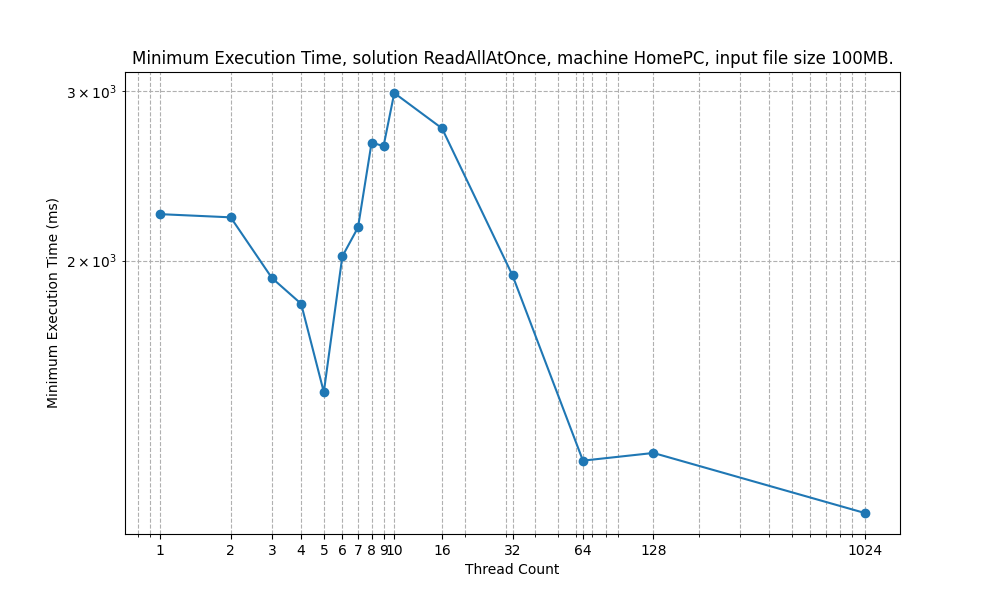

---
Резултати от решение "Изчитане наведнъж" при четене на файл *300 MB*, машина "Home PC" (_таблица 4_):


| # | p | G | Tp(1) | Tp(2) | Tp(3) | Tp(min) | Sp | Ep |
|---|---|---|-------|-------|-------|----|----|----|
| 1  | 1  | 1  | 9456ms | 9795ms | 9553ms | 9456ms | 1.000000 | 1.000000 |
| 2  | 2  | 1  | 18150ms | 16403ms | 16836ms | 16403ms | 0.576480 | 0.288240 |
| 3  | 3  | 1  | 16599ms | 21735ms | 19744ms | 16599ms | 0.569673 | 0.189891 |
| 4  | 4  | 1  | 17394ms | 19099ms | 20118ms | 17394ms | 0.543636 | 0.135909 |
| 5  | 5  | 1  | 19153ms | 21386ms | 19965ms | 19153ms | 0.493709 | 0.098742 |
| 6  | 6  | 1  | 18399ms | 29957ms | 19062ms | 18399ms | 0.513941 | 0.085657 |
| 7  | 7  | 1  | 19745ms | 18900ms | 20859ms | 18900ms | 0.500317 | 0.071474 |
| 8  | 8  | 1  | 22914ms | 23760ms | 23979ms | 22914ms | 0.412673 | 0.051584 |
| 9  | 9  | 1  | 24573ms | 22810ms | 21297ms | 21297ms | 0.444006 | 0.049334 |
| 10 | 10 | 1  | 26675ms | 20560ms | 20512ms | 20512ms | 0.460998 | 0.046100 |
| 11 | 16 | 1  | 22583ms | 20736ms | 23473ms | 20736ms | 0.456019 | 0.028501 |
| 12 | 32 | 1  | 22194ms | 44400ms | 35639ms | 22194ms | 0.426061 | 0.013314 |
| 13 | 64 | 1  | 24253ms | 16726ms | 16839ms | 16726ms | 0.565347 | 0.008834 |
| 14 | 128 | 1  | 15853ms | 16239ms | 15985ms | 15853ms | 0.596480 | 0.004660 |
| 15 | 1024 | 1  | 15617ms | 17366ms | 15478ms | 15478ms | 0.610932 | 0.000597 |

Графика на времето от решение "Изчитане наведнъж" при четене на файл *300 MB*, машина "Home PC"
(_фигура 4_):

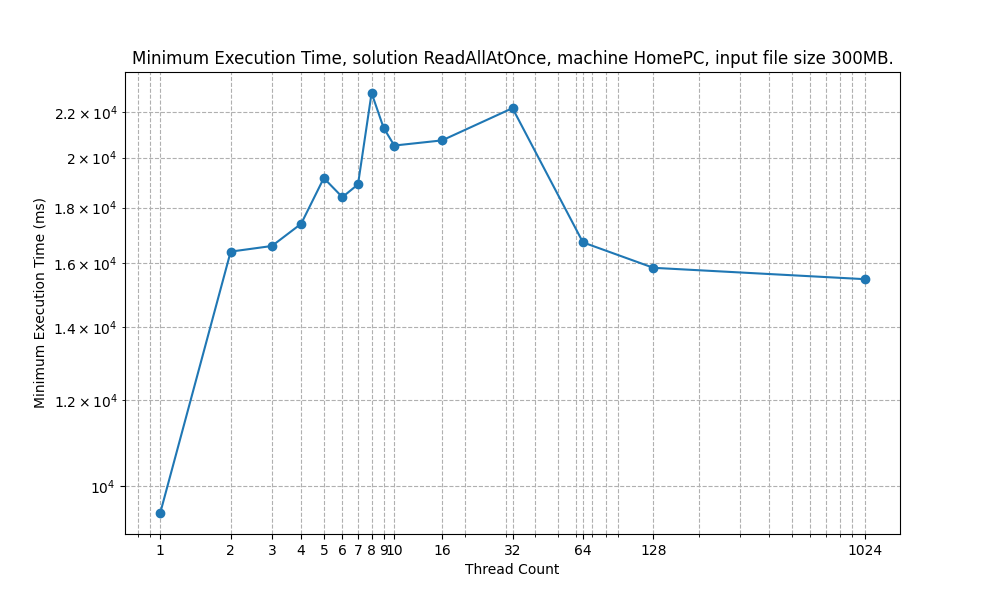

Графика на ускорението от решение "Изчитане наведнъж" при четене на файл *300 MB*, машина "Home PC"
(_фигура 5_):

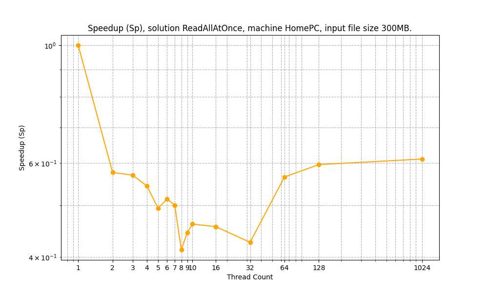

---
Резултати от решение "Изчитане наведнъж" при четене на файл *500 MB*, машина "Home PC" (_таблица 5_):


| # | p | G | Tp(1) | Tp(2) | Tp(3) | Tp(min) | Sp | Ep |
|---|---|---|-------|-------|-------|----|----|----|
| 1  | 1  | 1  | 10993ms | 10779ms | 11070ms | 10779ms | 1.000000 | 1.000000 |
| 2  | 2  | 1  | 10673ms | 10457ms | 10887ms | 10457ms | 1.030793 | 0.515396 |
| 3  | 4  | 1  | 6959ms | 7457ms | 7226ms | 6959ms | 1.548929 | 0.387232 |
| 4  | 8  | 1  | 5806ms | 5548ms | 5548ms | 5548ms | 1.942862 | 0.242858 |
| 5  | 16 | 1  | 4861ms | 4770ms | 5864ms | 4770ms | 2.259748 | 0.141234 |
| 6  | 32 | 1  | 4414ms | 4819ms | 4892ms | 4414ms | 2.442003 | 0.076313 |
| 7  | 64 | 1  | 5180ms | 5393ms | 5138ms | 5138ms | 2.097898 | 0.032780 |
| 8  | 128 | 1  | 4073ms | 4459ms | 4299ms | 4073ms | 2.646452 | 0.020675 |
| 9  | 1024 | 1  | 4482ms | 4450ms | 4479ms | 4450ms | 2.422247 | 0.002365 |

Графика на времето от решение "Изчитане наведнъж" при четене на файл *500 MB*, машина "Home PC"
(_фигура 6_):


Графика на ускорението от решение "Изчитане наведнъж" при четене на файл *500 MB*, машина "Home PC"
(_фигура 7_):

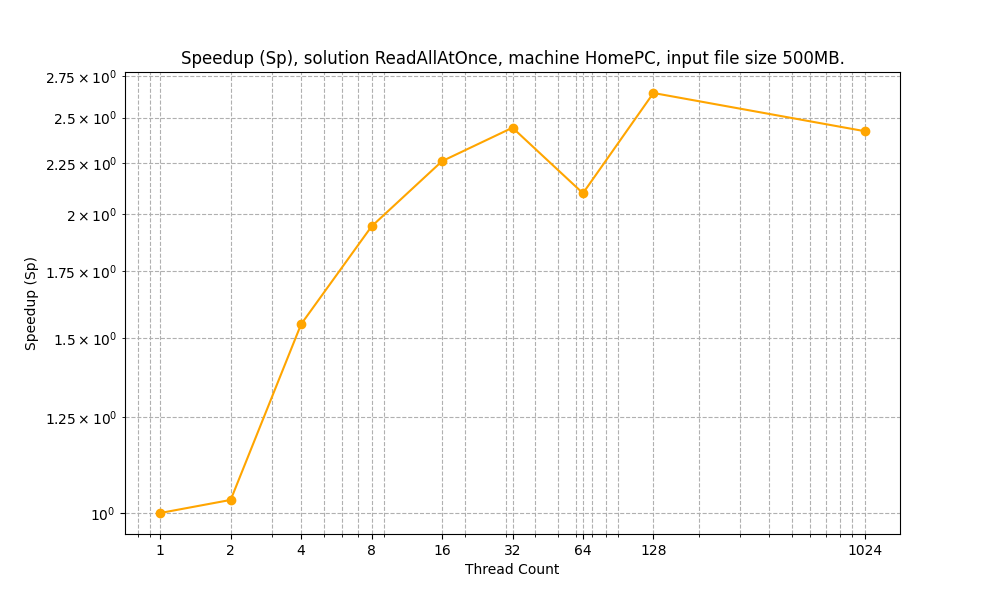

---
Резултати от решение "Изчитане наведнъж" при четене на файл *1000 MB*, машина "Home PC" (_таблица 6_):

| # | p | G | Tp(1) | Tp(2) | Tp(3) | Tp(min) | Sp | Ep |
|---|---|---|-------|-------|-------|----|----|----|
| 1  | 1  | 1  | 14570ms | 11577ms | 11687ms | 11577ms | 1.000000 | 1.000000 |
| 2  | 2  | 1  | 11197ms | 9857ms | 10290ms | 9857ms | 1.174495 | 0.587248 |
| 3  | 4  | 1  | 7335ms | 8165ms | 7585ms | 7335ms | 1.578323 | 0.394581 |
| 4  | 8  | 1  | 5768ms | 5587ms | 5576ms | 5576ms | 2.076220 | 0.259527 |
| 5  | 16 | 1  | 4925ms | 4924ms | 4841ms | 4841ms | 2.391448 | 0.149466 |
| 6  | 32 | 1  | 4816ms | 4868ms | 4983ms | 4816ms | 2.403862 | 0.075121 |
| 7  | 64 | 1  | 5004ms | 5389ms | 5212ms | 5004ms | 2.313549 | 0.036149 |
| 8  | 128 | 1  | 5383ms | 5252ms | 5132ms | 5132ms | 2.255846 | 0.017624 |
| 9  | 1024 | 1  | 4313ms | 4514ms | 4495ms | 4313ms | 2.684211 | 0.002621 |

Графика на времето от решение "Изчитане наведнъж" при четене на файл *1000 MB*, машина "Home PC"
(_фигура 8_):

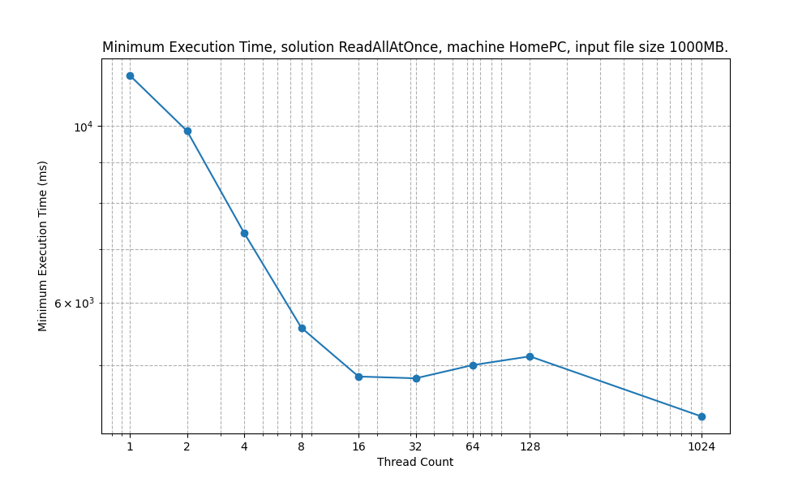


---
Резултати от решение "Изчитане наведнъж" при четене на файл *300 MB*, машина "t5600" (_таблица 7_):

| # | p | G | Tp(1) | Tp(2) | Tp(3) | Tp(min) | Sp | Ep |
|---|---|---|-------|-------|-------|----|----|----|
| 1  | 1  | 1  | 7608ms | 7584ms | 7607ms | 7584ms | 1.000000 | 1.000000 |
| 2  | 2  | 1  | 34934ms | 32621ms | 33768ms | 32621ms | 0.232488 | 0.116244 |
| 3  | 4  | 1  | 55997ms | 49641ms | 34783ms | 34783ms | 0.218038 | 0.054509 |
| 4  | 8  | 1  | 41765ms | 41447ms | 49779ms | 41447ms | 0.182980 | 0.0228725 |

Графика на времето от решение "Изчитане наведнъж" при четене на файл *300 MB*, машина "t5600"
(_фигура 9_):

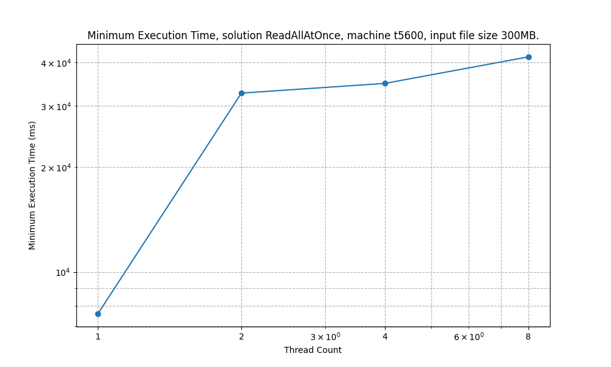

---
Резултати от решение "Изчитане наведнъж" при четене на файл *500 MB*, машина "t5600" (_таблица 8_):

| # | p | G | Tp(1) | Tp(2) | Tp(3) | Tp(min) | Sp | Ep |
|---|---|---|-------|-------|-------|----|----|----|
| 1  | 1  | 1  | 12725ms | 12561ms | 12528ms | 12528ms | 1.000000 | 1.000000 |
| 2  | 2  | 1  | 51763ms | 53182ms | 51864ms | 51763ms | 0.242026 | 0.121013 |
| 3  | 4  | 1  | 55789ms | 84889ms | 74577ms | 55789ms | 0.224560 | 0.056140 |
| 4  | 8  | 1  | 69366ms | 68123ms | 73179ms | 68123ms | 0.183903 | 0.022988 |

Графика на времето от решение "Изчитане наведнъж" при четене на файл *500 MB*, машина "t5600"
(_фигура 10_):


---

Резултати от решение "Изчитане наведнъж" при четене на файл *1000 MB*, машина "t5600" (_таблица 9_):

| # | p | G | Tp(1) | Tp(2) | Tp(3) | Tp(min) | Sp | Ep |
|---|---|---|-------|-------|-------|----|----|----|
| 1  | 1  | 1  | 25158ms | 25029ms | 25253ms | 25029ms | 1.000000 | 1.000000 |
| 2  | 2  | 1  | 55230ms | 56797ms | 57546ms | 55230ms | 0.453178 | 0.226589 |
| 3  | 4  | 1  | 133729ms | 124239ms | 146021ms | 124239ms | 0.201458 | 0.050365 |
| 4  | 8  | 1  | 154782ms | 126549ms | 145557ms | 126549ms | 0.197781 | 0.024723 |

Графика на времето от решение "Изчитане наведнъж" при четене на файл *1000 MB*, машина "t5600"
(_фигура 11_):

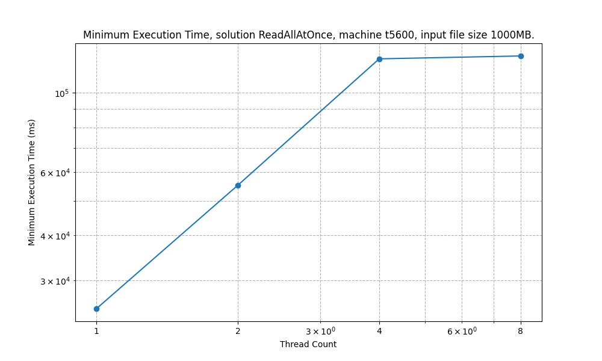


### 4.4 Анализ на получените резултати

Наблюденията над "Home PC" показват, че pри файлове с големина 100 и 300 MB увеличаването на броя нишки забавя програмата, но при файлове с големина 500, 1000 MB времето намаля с нарастването на нишките.

При малки файлове (100 и 300 MB), времето за обработка на всеки малък фрагмент от данни е относително кратко. Това означава, че нишките прекарват повече време в синхронизация и смяна на контекста, отколкото в реална работа. При 500 MB файл, всяка нишка обработва по-голямо количество данни, което прави влиянието на синхронизацията по-малко забележимо, тъй като по-голямата част от времето се изразходва за реална работа.

Това обаче не се случва на машината "t5600". Не се наблюдава подобрение с увеличаване на броя на нишките нито при 100, 300, 500 MB файлове. Сървърът има повече ядра (16 физически, 32 с HT) в сравнение с "Home PC", както и различен кеш. Освен това "t5600" използва хипернишкова технология, което позволява на всяко ядро да обработва две нишки едновременно. Поради тези различия не може да се достигне оптималната големина за обработване в "t5600".

<div class="page"/>

## 5. Решение "Изчитане на парчета"

### 5.1 Описание на решението

В този подход всяка нишка чета зададено количество от файла и пресмята честота на символите в него. След приключване на изчетеното парче, нишката прочита следващо необработено парче данни от входния файл. Това продължава, докато целият файл не бъде изчетен. Всяка нишка използва общ брояч за текущата позиция във файла, който се актуализира чрез атомарна операция, за да се избегне припокриване при четенето.

Този подход комбинира ефективността на паралелното четене с простотата на обработка на парчета от данни, което позволява лесно мащабиране и подобрена производителност. Използването на атомарни операции и синхронизация само когато е необходимо, минимизира времето за блокиране на нишките и подобрява цялостната производителност на програмата.

Така се постига едно огромно преимущество пред "Изчитане наведнъж" - възможността да се обработват входни данни, които не могат директно да се заредят в паметта на машината.

### 5.2 Имплементация на решението

Кодът, който всяка нишка изпълнява (_код 5_):

```java

@Override
public void run() {
    long startTime = System.currentTimeMillis();
    System.out.println("Thread-" + threadId + " started.");

    try {
        while (true) {
            long currentPointer = filePointer.getAndAdd(chunkSize);
            if (currentPointer >= file.length()) {
                break;
            }

            byte[] buffer = new byte[chunkSize];
            synchronized (file) {
                file.seek(currentPointer);
                int bytesRead = file.read(buffer);

                if (bytesRead == -1) {
                    break;
                }

                for (int i = 0; i < bytesRead; i++) {
                    char character = (char) buffer[i];
                    frequencyTable.computeIfAbsent(character, k -> new AtomicInteger()).incrementAndGet();
                }
            }
        }
    } catch (IOException e) {
        e.printStackTrace();
    }

    long endTime = System.currentTimeMillis();
    System.out.println("Thread-" + threadId + " stopped.");
    System.out.println("Thread-" + threadId + " execution time was (millis): " + (endTime - startTime));
}
```
---

Кодът за паралелно изпълнение на програмата (_код 6_):

```java
private static void runMultiThreaded(RandomAccessFile file) {
    long startTime = System.currentTimeMillis();
    ExecutorService executor = Executors.newFixedThreadPool(numThreads);
    List<Future<?>> futures = new ArrayList<>();

    for (int i = 0; i < numThreads; i++) {
        HuffmanParallelReadChunks task = new HuffmanParallelReadChunks(i + 1, file);
        futures.add(executor.submit(task));
    }
    ...
}
```

### 5.3 Резултати от решението

Резултати от решение "Изчитане на парчета" при четене на файл *300 MB*, машина "Home PC" (_таблица 9_):

| Chunk Size (KB) | # | p | G | Tp(1) | Tp(2) | Tp(3) | Tp(min) | Sp | Ep |
|-----------------|---|---|---|-------|-------|-------|---------|----|----|
| 4                 | 1  | 1  | 76800.00 | 5233ms | 5251ms | 5508ms | 5233ms  | 1.000000 | 1.000000 |
| 4                 | 2  | 2  | 76800.00 | 5807ms | 5757ms | 5782ms | 5757ms  | 0.908980 | 0.454490 |
| 4                 | 3  | 4  | 76800.00 | 5803ms | 5773ms | 6223ms | 5773ms  | 0.906461 | 0.226615 |
| 4                 | 4  | 8  | 76800.00 | 5836ms | 5778ms | 5509ms | 5509ms  | 0.949900 | 0.118738 |
| 4                 | 5  | 16 | 76800.00 | 5816ms | 5535ms | 5491ms | 5491ms  | 0.953014 | 0.059563 |
| 4                 | 6  | 32 | 76800.00 | 5810ms | 5816ms | 5810ms | 5810ms  | 0.900688 | 0.028147 |
| 4                 | 7  | 64 | 76800.00 | 5686ms | 5813ms | 5911ms | 5686ms  | 0.920331 | 0.014380 |
| 4                 | 8  | 128 | 76800.00 | 5752ms | 5855ms | 5820ms | 5752ms  | 0.909771 | 0.007108 |
| 4                 | 9  | 1024 | 76800.00 | 5691ms | 5732ms | 5726ms | 5691ms  | 0.919522 | 0.000898 |
| 8                 | 1  | 1  | 38400.00 | 5113ms | 5326ms | 5330ms | 5113ms  | 1.000000 | 1.000000 |
| 8                 | 2  | 2  | 38400.00 | 5533ms | 5191ms | 5488ms | 5191ms  | 0.984974 | 0.492487 |
| 8                 | 3  | 4  | 38400.00 | 5478ms | 5534ms | 5448ms | 5448ms  | 0.938510 | 0.234627 |
| 8                 | 4  | 8  | 38400.00 | 5534ms | 5507ms | 5502ms | 5502ms  | 0.929298 | 0.116162 |
| 8                 | 5  | 16 | 38400.00 | 5620ms | 5292ms | 5541ms | 5292ms  | 0.966175 | 0.060386 |
| 8                 | 6  | 32 | 38400.00 | 5539ms | 5489ms | 5503ms | 5489ms  | 0.931499 | 0.029109 |
| 8                 | 7  | 64 | 38400.00 | 5522ms | 5243ms | 5530ms | 5243ms  | 0.975205 | 0.015238 |
| 8                 | 8  | 128 | 38400.00 | 5960ms | 5568ms | 5582ms | 5568ms  | 0.918283 | 0.007174 |
| 8                 | 9  | 1024 | 38400.00 | 5475ms | 5521ms | 5410ms | 5410ms  | 0.945102 | 0.000923 |
| 16                | 1  | 1  | 19200.00 | 5384ms | 5699ms | 5568ms | 5384ms  | 1.000000 | 1.000000 |
| 16                | 2  | 2  | 19200.00 | 5862ms | 5922ms | 5459ms | 5459ms  | 0.986261 | 0.493131 |
| 16                | 3  | 4  | 19200.00 | 6178ms | 5833ms | 5703ms | 5703ms  | 0.944065 | 0.236016 |
| 16                | 4  | 8  | 19200.00 | 5848ms | 5971ms | 5976ms | 5848ms  | 0.920657 | 0.115082 |
| 16                | 5  | 16 | 19200.00 | 6073ms | 5766ms | 5958ms | 5766ms  | 0.933750 | 0.058359 |
| 16                | 6  | 32 | 19200.00 | 5970ms | 5892ms | 5876ms | 5876ms  | 0.916270 | 0.028633 |
| 16                | 7  | 64 | 19200.00 | 5858ms | 5835ms | 5777ms | 5777ms  | 0.931972 | 0.014562 |
| 16                | 8  | 128 | 19200.00 | 5956ms | 5582ms | 5870ms | 5582ms  | 0.964529 | 0.007535 |
| 16                | 9  | 1024 | 19200.00 | 5944ms | 5682ms | 5519ms | 5519ms  | 0.975539 | 0.000953 |
| 32                | 1  | 1  | 9600.00 | 5637ms | 5259ms | 5281ms | 5259ms  | 1.000000 | 1.000000 |
| 32                | 2  | 2  | 9600.00 | 5708ms | 5730ms | 5730ms | 5708ms  | 0.921338 | 0.460669 |
| 32                | 3  | 4  | 9600.00 | 5465ms | 5463ms | 5739ms | 5463ms  | 0.962658 | 0.240664 |
| 32                | 4  | 8  | 9600.00 | 5744ms | 5719ms | 5694ms | 5694ms  | 0.923604 | 0.115450 |
| 32                | 5  | 16 | 9600.00 | 5757ms | 5664ms | 5706ms | 5664ms  | 0.928496 | 0.058031 |
| 32                | 6  | 32 | 9600.00 | 5695ms | 5689ms | 5733ms | 5689ms  | 0.924416 | 0.028888 |
| 32                | 7  | 64 | 9600.00 | 5763ms | 5751ms | 5737ms | 5737ms  | 0.916681 | 0.014323 |
| 32                | 8  | 128 | 9600.00 | 5585ms | 5543ms | 5750ms | 5543ms  | 0.948764 | 0.007412 |
| 32                | 9  | 1024 | 9600.00 | 5443ms | 5376ms | 5360ms | 5360ms  | 0.981157 | 0.000958 |
| 64                | 1  | 1  | 4800.00 | 5218ms | 5375ms | 5342ms | 5218ms  | 1.000000 | 1.000000 |
| 64                | 2  | 2  | 4800.00 | 5449ms | 5364ms | 5684ms | 5364ms  | 0.972782 | 0.486391 |
| 64                | 3  | 4  | 4800.00 | 5644ms | 5638ms | 5607ms | 5607ms  | 0.930622 | 0.232656 |
| 64                | 4  | 8  | 4800.00 | 5373ms | 5626ms | 5640ms | 5373ms  | 0.971152 | 0.121394 |
| 64                | 5  | 16 | 4800.00 | 5400ms | 5613ms | 5672ms | 5400ms  | 0.966296 | 0.060394 |
| 64                | 6  | 32 | 4800.00 | 5644ms | 5613ms | 5649ms | 5613ms  | 0.929628 | 0.029051 |
| 64                | 7  | 64 | 4800.00 | 5402ms | 5636ms | 5509ms | 5402ms  | 0.965939 | 0.015093 |
| 64                | 8  | 128 | 4800.00 | 5855ms | 5777ms | 5820ms | 5777ms  | 0.903237 | 0.007057 |
| 64                | 9  | 1024 | 4800.00 | 5463ms | 5475ms | 5614ms | 5463ms  | 0.955153 | 0.000933 |
| 128               | 1  | 1  | 2400.00 | 5331ms | 5706ms | 5647ms | 5331ms  | 1.000000 | 1.000000 |
| 128               | 2  | 2  | 2400.00 | 5775ms | 5613ms | 5644ms | 5613ms  | 0.949759 | 0.474880 |
| 128               | 3  | 4  | 2400.00 | 5371ms | 5583ms | 5602ms | 5371ms  | 0.992553 | 0.248138 |
| 128               | 4  | 8  | 2400.00 | 5354ms | 5324ms | 5364ms | 5324ms  | 1.001315 | 0.125164 |
| 128               | 5  | 16 | 2400.00 | 5617ms | 5595ms | 5326ms | 5326ms  | 1.000939 | 0.062559 |
| 128               | 6  | 32 | 2400.00 | 5321ms | 5602ms | 5632ms | 5321ms  | 1.001879 | 0.031309 |
| 128               | 7  | 64 | 2400.00 | 5697ms | 5778ms | 5840ms | 5697ms  | 0.935756 | 0.014621 |
| 128               | 8  | 128 | 2400.00 | 5717ms | 5809ms | 5373ms | 5373ms  | 0.992183 | 0.007751 |
| 128               | 9  | 1024 | 2400.00 | 6234ms | 5600ms | 5814ms | 5600ms  | 0.951964 | 0.000930 |
| 256               | 1  | 1  | 1200.00 | 5323ms | 5223ms | 5261ms | 5223ms  | 1.000000 | 1.000000 |
| 256               | 2  | 2  | 1200.00 | 5621ms | 5637ms | 5544ms | 5544ms  | 0.942100 | 0.471050 |
| 256               | 3  | 4  | 1200.00 | 5535ms | 5644ms | 5300ms | 5300ms  | 0.985472 | 0.246368 |
| 256               | 4  | 8  | 1200.00 | 5342ms | 5245ms | 5575ms | 5245ms  | 0.995806 | 0.124476 |
| 256               | 5  | 16 | 1200.00 | 5343ms | 5592ms | 5321ms | 5321ms  | 0.981582 | 0.061349 |
| 256               | 6  | 32 | 1200.00 | 5380ms | 5544ms | 5635ms | 5380ms  | 0.970818 | 0.030338 |
| 256               | 7  | 64 | 1200.00 | 5601ms | 5598ms | 5653ms | 5598ms  | 0.933012 | 0.014578 |
| 256               | 8  | 128 | 1200.00 | 5983ms | 5913ms | 5479ms | 5479ms  | 0.953276 | 0.007447 |
| 256               | 9  | 1024 | 1200.00 | 6278ms | 6275ms | 6145ms | 6145ms  | 0.849959 | 0.000830 |
| 512               | 1  | 1  | 600.00 | 5332ms | 5531ms | 5270ms | 5270ms  | 1.000000 | 1.000000 |
| 512               | 2  | 2  | 600.00 | 5539ms | 5636ms | 5763ms | 5539ms  | 0.951435 | 0.475718 |
| 512               | 3  | 4  | 600.00 | 5752ms | 5475ms | 5768ms | 5475ms  | 0.962557 | 0.240639 |
| 512               | 4  | 8  | 600.00 | 5777ms | 5818ms | 5418ms | 5418ms  | 0.972684 | 0.121585 |
| 512               | 5  | 16 | 600.00 | 5492ms | 5422ms | 5496ms | 5422ms  | 0.971966 | 0.060748 |
| 512               | 6  | 32 | 600.00 | 5828ms | 5769ms | 5717ms | 5717ms  | 0.921812 | 0.028807 |
| 512               | 7  | 64 | 600.00 | 5858ms | 5823ms | 5886ms | 5823ms  | 0.905032 | 0.014141 |
| 512               | 8  | 128 | 600.00 | 5900ms | 5931ms | 5821ms | 5821ms  | 0.905343 | 0.007073 |
| 512               | 9  | 1024 | 600.00 | 6199ms | 5825ms | 6234ms | 5825ms  | 0.904721 | 0.000884 |
| 1024              | 1  | 1  | 300.00 | 5788ms | 5871ms | 5476ms | 5476ms  | 1.000000 | 1.000000 |
| 1024              | 2  | 2  | 300.00 | 5860ms | 5896ms | 5905ms | 5860ms  | 0.934471 | 0.467235 |
| 1024              | 3  | 4  | 300.00 | 5576ms | 5588ms | 5743ms | 5576ms  | 0.982066 | 0.245516 |
| 1024              | 4  | 8  | 300.00 | 5465ms | 5864ms | 5845ms | 5465ms  | 1.002013 | 0.125252 |
| 1024              | 5  | 16 | 300.00 | 5579ms | 5901ms | 5896ms | 5579ms  | 0.981538 | 0.061346 |
| 1024              | 6  | 32 | 300.00 | 5915ms | 5940ms | 5990ms | 5915ms  | 0.925782 | 0.028931 |
| 1024              | 7  | 64 | 300.00 | 6019ms | 5738ms | 6016ms | 5738ms  | 0.954339 | 0.014912 |
| 1024              | 8  | 128 | 300.00 | 6263ms | 6061ms | 6226ms | 6061ms  | 0.903481 | 0.007058 |
| 1024              | 9  | 1024 | 300.00 | 5964ms | 5753ms | 5741ms | 5741ms  | 0.953841 | 0.000931 |

Графика на времето от решение "Изчитане на парчета" при четене на файл *300 MB*, машина "Home PC" (_фигура 12_):


Графика на ускорението от решение "Изчитане на парчета" при четене на файл *300 MB*, машина "Home PC" (_фигура 13_):


Графика на ефективността от решение "Изчитане на парчета" при четене на файл *300 MB*, машина "Home PC" (_фигура 14_):

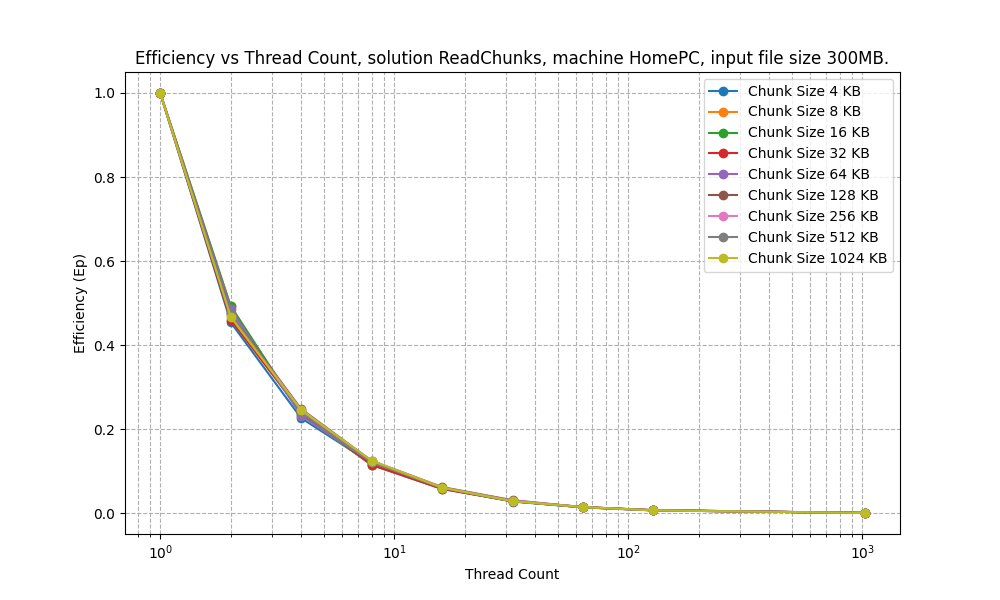

---

Резултати от решение "Изчитане на парчета" при четене на файл *500 MB*, машина "Home PC" (_таблица 10_):

| Chunk Size (KB) | # | p | G | Tp(1) | Tp(2) | Tp(3) | Tp(min) | Sp | Ep |
|-----------------|---|---|---|-------|-------|-------|---------|----|----|
| 4                 | 1  | 1  | 128000.00 | 5469ms | 5477ms | 5430ms | 5430ms  | 1.000000 | 1.000000 |
| 4                 | 2  | 2  | 128000.00 | 5790ms | 5823ms | 5772ms | 5772ms  | 0.940748 | 0.470374 |
| 4                 | 3  | 4  | 128000.00 | 5911ms | 5771ms | 5797ms | 5771ms  | 0.940911 | 0.235228 |
| 4                 | 4  | 8  | 128000.00 | 5812ms | 5735ms | 5747ms | 5735ms  | 0.946818 | 0.118352 |
| 4                 | 5  | 16 | 128000.00 | 5862ms | 5784ms | 5822ms | 5784ms  | 0.938797 | 0.058675 |
| 4                 | 6  | 32 | 128000.00 | 5732ms | 5826ms | 5746ms | 5732ms  | 0.947313 | 0.029604 |
| 4                 | 7  | 64 | 128000.00 | 5772ms | 5888ms | 5744ms | 5744ms  | 0.945334 | 0.014771 |
| 4                 | 8  | 128 | 128000.00 | 5701ms | 5722ms | 5704ms | 5701ms  | 0.952464 | 0.007441 |
| 4                 | 9  | 1024 | 128000.00 | 5815ms | 6035ms | 5742ms | 5742ms  | 0.945664 | 0.000923 |
| 16                | 1  | 1  | 32000.00 | 5515ms | 5681ms | 5423ms | 5423ms  | 1.000000 | 1.000000 |
| 16                | 2  | 2  | 32000.00 | 5721ms | 5726ms | 5368ms | 5368ms  | 1.010246 | 0.505123 |
| 16                | 3  | 4  | 32000.00 | 5606ms | 5369ms | 5633ms | 5369ms  | 1.010058 | 0.252514 |
| 16                | 4  | 8  | 32000.00 | 5369ms | 5319ms | 5646ms | 5319ms  | 1.019553 | 0.127444 |
| 16                | 5  | 16 | 32000.00 | 5614ms | 5337ms | 5601ms | 5337ms  | 1.016114 | 0.063507 |
| 16                | 6  | 32 | 32000.00 | 5662ms | 5730ms | 5666ms | 5662ms  | 0.957789 | 0.029931 |
| 16                | 7  | 64 | 32000.00 | 5332ms | 5669ms | 5719ms | 5332ms  | 1.017067 | 0.015892 |
| 16                | 8  | 128 | 32000.00 | 5652ms | 5537ms | 5833ms | 5537ms  | 0.979411 | 0.007652 |
| 16                | 9  | 1024 | 32000.00 | 5801ms | 5413ms | 5765ms | 5413ms  | 1.001847 | 0.000978 |
| 32                | 1  | 1  | 16000.00 | 5515ms | 5461ms | 5451ms | 5451ms  | 1.000000 | 1.000000 |
| 32                | 2  | 2  | 16000.00 | 5698ms | 5646ms | 5724ms | 5646ms  | 0.965462 | 0.482731 |
| 32                | 3  | 4  | 16000.00 | 5630ms | 5534ms | 5698ms | 5534ms  | 0.985002 | 0.246250 |
| 32                | 4  | 8  | 16000.00 | 5494ms | 5574ms | 5470ms | 5470ms  | 0.996527 | 0.124566 |
| 32                | 5  | 16 | 16000.00 | 5569ms | 5493ms | 5533ms | 5493ms  | 0.992354 | 0.062022 |
| 32                | 6  | 32 | 16000.00 | 5508ms | 5488ms | 5555ms | 5488ms  | 0.993258 | 0.031039 |
| 32                | 7  | 64 | 16000.00 | 5653ms | 5682ms | 5588ms | 5588ms  | 0.975483 | 0.015242 |
| 32                | 8  | 128 | 16000.00 | 5627ms | 5644ms | 5748ms | 5627ms  | 0.968722 | 0.007568 |
| 32                | 9  | 1024 | 16000.00 | 5420ms | 5408ms | 5401ms | 5401ms  | 1.009258 | 0.000986 |
| 64                | 1  | 1  | 8000.00 | 5536ms | 5467ms | 5517ms | 5467ms  | 1.000000 | 1.000000 |
| 64                | 2  | 2  | 8000.00 | 5653ms | 5574ms | 5666ms | 5574ms  | 0.980804 | 0.490402 |
| 64                | 3  | 4  | 8000.00 | 5743ms | 5601ms | 5496ms | 5496ms  | 0.994723 | 0.248681 |
| 64                | 4  | 8  | 8000.00 | 5591ms | 5642ms | 5853ms | 5591ms  | 0.977821 | 0.122228 |
| 64                | 5  | 16 | 8000.00 | 5648ms | 5609ms | 5557ms | 5557ms  | 0.983804 | 0.061488 |
| 64                | 6  | 32 | 8000.00 | 5537ms | 5540ms | 5472ms | 5472ms  | 0.999086 | 0.031221 |
| 64                | 7  | 64 | 8000.00 | 5554ms | 5605ms | 5643ms | 5554ms  | 0.984336 | 0.015380 |
| 64                | 8  | 128 | 8000.00 | 5599ms | 5627ms | 5570ms | 5570ms  | 0.981508 | 0.007668 |
| 64                | 9  | 1024 | 8000.00 | 5280ms | 5287ms | 5295ms | 5280ms  | 1.035417 | 0.001011 |
| 256               | 1  | 1  | 2000.00 | 5416ms | 5512ms | 5442ms | 5416ms  | 1.000000 | 1.000000 |
| 256               | 2  | 2  | 2000.00 | 5636ms | 5516ms | 5724ms | 5516ms  | 0.981871 | 0.490935 |
| 256               | 3  | 4  | 2000.00 | 5566ms | 5600ms | 5605ms | 5566ms  | 0.973051 | 0.243263 |
| 256               | 4  | 8  | 2000.00 | 5623ms | 5674ms | 5572ms | 5572ms  | 0.972003 | 0.121500 |
| 256               | 5  | 16 | 2000.00 | 5762ms | 5555ms | 5514ms | 5514ms  | 0.982227 | 0.061389 |
| 256               | 6  | 32 | 2000.00 | 5439ms | 5589ms | 5586ms | 5439ms  | 0.995771 | 0.031118 |
| 256               | 7  | 64 | 2000.00 | 5657ms | 5584ms | 5560ms | 5560ms  | 0.974101 | 0.015220 |
| 256               | 8  | 128 | 2000.00 | 5825ms | 5715ms | 5610ms | 5610ms  | 0.965419 | 0.007542 |
| 256               | 9  | 1024 | 2000.00 | 6300ms | 5910ms | 6162ms | 5910ms  | 0.916413 | 0.000895 |
| 512               | 1  | 1  | 1000.00 | 5532ms | 5513ms | 5564ms | 5513ms  | 1.000000 | 1.000000 |
| 512               | 2  | 2  | 1000.00 | 5563ms | 5523ms | 5643ms | 5523ms  | 0.998189 | 0.499095 |
| 512               | 3  | 4  | 1000.00 | 5482ms | 5480ms | 5523ms | 5480ms  | 1.006022 | 0.251505 |
| 512               | 4  | 8  | 1000.00 | 5512ms | 5543ms | 5601ms | 5512ms  | 1.000181 | 0.125023 |
| 512               | 5  | 16 | 1000.00 | 5465ms | 5517ms | 5486ms | 5465ms  | 1.008783 | 0.063049 |
| 512               | 6  | 32 | 1000.00 | 5543ms | 5567ms | 5717ms | 5543ms  | 0.994588 | 0.031081 |
| 512               | 7  | 64 | 1000.00 | 5774ms | 5736ms | 5642ms | 5642ms  | 0.977136 | 0.015268 |
| 512               | 8  | 128 | 1000.00 | 5664ms | 5700ms | 5747ms | 5664ms  | 0.973340 | 0.007604 |
| 512               | 9  | 1024 | 1000.00 | 5949ms | 5890ms | 5981ms | 5890ms  | 0.935993 | 0.000914 |
| 1024              | 1  | 1  | 500.00 | 5488ms | 5581ms | 5630ms | 5488ms  | 1.000000 | 1.000000 |
| 1024              | 2  | 2  | 500.00 | 5836ms | 5732ms | 5719ms | 5719ms  | 0.959608 | 0.479804 |
| 1024              | 3  | 4  | 500.00 | 5622ms | 5665ms | 5778ms | 5622ms  | 0.976165 | 0.244041 |
| 1024              | 4  | 8  | 500.00 | 5601ms | 5807ms | 5691ms | 5601ms  | 0.979825 | 0.122478 |
| 1024              | 5  | 16 | 500.00 | 5583ms | 5727ms | 5742ms | 5583ms  | 0.982984 | 0.061437 |
| 1024              | 6  | 32 | 500.00 | 5912ms | 5863ms | 5755ms | 5755ms  | 0.953606 | 0.029800 |
| 1024              | 7  | 64 | 500.00 | 5829ms | 5991ms | 6004ms | 5829ms  | 0.941499 | 0.014711 |
| 1024              | 8  | 128 | 500.00 | 5874ms | 5875ms | 5770ms | 5770ms  | 0.951127 | 0.007431 |
| 1024              | 9  | 1024 | 500.00 | 6262ms | 5964ms | 6081ms | 5964ms  | 0.920188 | 0.000899 |
| 10240             | 1  | 1  | 50.00 | 5562ms | 5614ms | 5749ms | 5562ms  | 1.000000 | 1.000000 |
| 10240             | 2  | 2  | 50.00 | 5755ms | 5584ms | 5543ms | 5543ms  | 1.003428 | 0.501714 |
| 10240             | 3  | 4  | 50.00 | 5689ms | 5741ms | 5616ms | 5616ms  | 0.990385 | 0.247596 |
| 10240             | 4  | 8  | 50.00 | 5730ms | 5833ms | 5629ms | 5629ms  | 0.988097 | 0.123512 |
| 10240             | 5  | 16 | 50.00 | 5701ms | 5832ms | 5730ms | 5701ms  | 0.975618 | 0.060976 |
| 10240             | 6  | 32 | 50.00 | 5916ms | 5859ms | 5804ms | 5804ms  | 0.958305 | 0.029947 |
| 10240             | 7  | 64 | 50.00 | 5659ms | 5738ms | 5707ms | 5659ms  | 0.982859 | 0.015357 |
| 10240             | 8  | 128 | 50.00 | 6047ms | 5833ms | 6021ms | 5833ms  | 0.953540 | 0.007450 |
| 10240             | 9  | 1024 | 50.00 | 6062ms | 6202ms | 6043ms | 6043ms  | 0.920404 | 0.000899 |
| 51200             | 1  | 1  | 10.00 | 5795ms | 5614ms | 5643ms | 5614ms  | 1.000000 | 1.000000 |
| 51200             | 2  | 2  | 10.00 | 5654ms | 5547ms | 5582ms | 5547ms  | 1.012079 | 0.506039 |
| 51200             | 3  | 4  | 10.00 | 5512ms | 5669ms | 5642ms | 5512ms  | 1.018505 | 0.254626 |
| 51200             | 4  | 8  | 10.00 | 5634ms | 5561ms | 5688ms | 5561ms  | 1.009531 | 0.126191 |
| 102400            | 1  | 1  | 5.00  | 5602ms | 5650ms | 5641ms | 5602ms  | 1.000000 | 1.000000 |
| 102400            | 2  | 2  | 5.00  | 5701ms | 5720ms | 5736ms | 5701ms  | 0.982635 | 0.491317 |
| 102400            | 3  | 4  | 5.00  | 5586ms | 5631ms | 5584ms | 5584ms  | 1.003223 | 0.250806 |
| 102400            | 4  | 8  | 5.00  | 5636ms | 5686ms | 8508ms | 5636ms  | 0.993967 | 0.124246 |

Графика на времето от решение "Изчитане на парчета" при четене на файл *500 MB*, машина "Home PC" (_фигура 15_):


Графика на ускорението от решение "Изчитане на парчета" при четене на файл *500 MB*, машина "Home PC" (_фигура 16_):

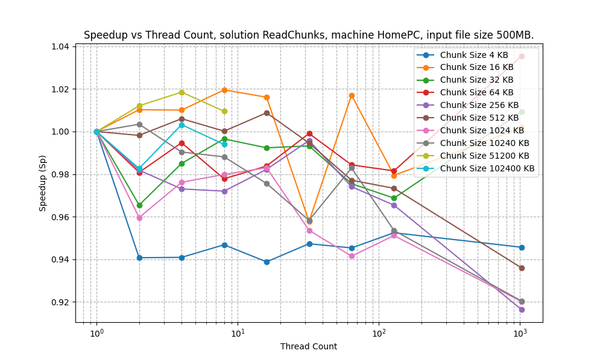


---

Резултати от решение "Изчитане на парчета" при четене на файл *1000 MB*, машина "Home PC" (_таблица 11_):


| Chunk Size (KB) | # | p | G | Tp(1) | Tp(2) | Tp(3) | Tp(min) | Sp | Ep |
|-----------------|---|---|---|-------|-------|-------|---------|----|----|
| 16384             | 1  | 1  | 62.50 | 24510ms | 23071ms | 27739ms | 23071ms | 1.000000 | 1.000000 |
| 16384             | 2  | 2  | 62.50 | 28504ms | 23930ms | 22799ms | 22799ms | 1.011930 | 0.505965 |
| 16384             | 3  | 4  | 62.50 | 22265ms | 23121ms | 21267ms | 21267ms | 1.084826 | 0.271207 |
| 16384             | 4  | 8  | 62.50 | 22894ms | 21564ms | 21525ms | 21525ms | 1.071823 | 0.133978 |
| 32768             | 1  | 1  | 31.25 | 20623ms | 21459ms | 26341ms | 20623ms | 1.000000 | 1.000000 |
| 32768             | 2  | 2  | 31.25 | 28585ms | 21367ms | 22683ms | 21367ms | 0.965180 | 0.482590 |
| 32768             | 3  | 4  | 31.25 | 21160ms | 20454ms | 20638ms | 20454ms | 1.008262 | 0.252066 |
| 32768             | 4  | 8  | 31.25 | 20489ms | 20339ms | 20505ms | 20339ms | 1.013963 | 0.126745 |
| 65536             | 1  | 1  | 15.62 | 20591ms | 20385ms | 20774ms | 20385ms | 1.000000 | 1.000000 |
| 65536             | 2  | 2  | 15.62 | 22372ms | 22560ms | 21992ms | 21992ms | 0.926928 | 0.463464 |
| 65536             | 3  | 4  | 15.62 | 21917ms | 22782ms | 23357ms | 21917ms | 0.930100 | 0.232525 |
| 65536             | 4  | 8  | 15.62 | 22824ms | 24752ms | 24272ms | 22824ms | 0.893139 | 0.111642 |
| 102400            | 1  | 1  | 10.00 | 22915ms | 23946ms | 23128ms | 22915ms | 1.000000 | 1.000000 |
| 102400            | 2  | 2  | 10.00 | 23128ms | 23200ms | 22937ms | 22937ms | 0.999041 | 0.499520 |
| 102400            | 3  | 4  | 10.00 | 22510ms | 23042ms | 22656ms | 22510ms | 1.017992 | 0.254498 |
| 102400            | 4  | 8  | 10.00 | 22748ms | 22854ms | 22967ms | 22748ms | 1.007341 | 0.125918 |


Графика на времето от решение "Изчитане на парчета" при четене на файл *1000 MB*, машина "Home PC" (_фигура 17_):

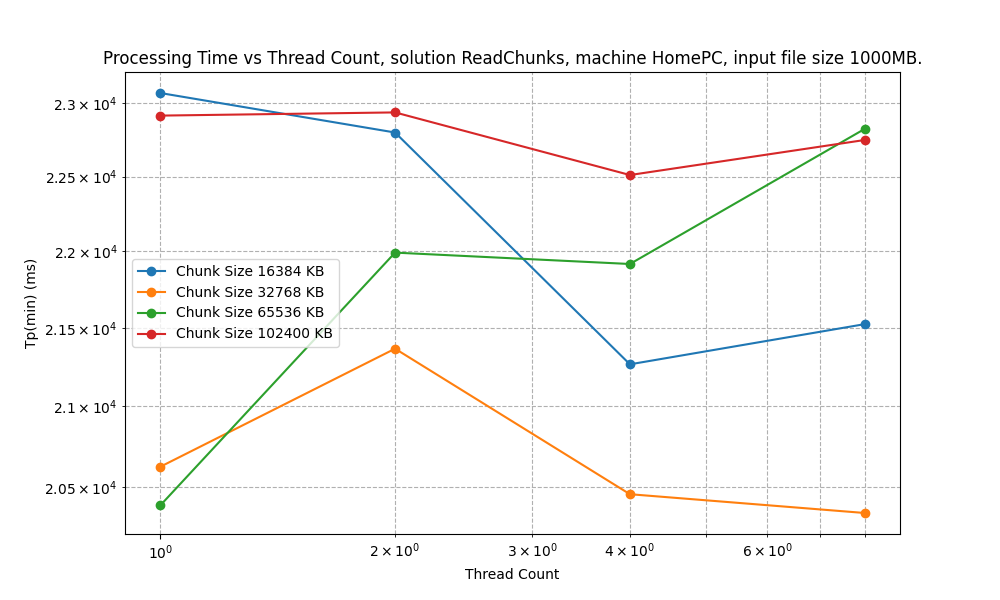

Графика на ускорението от решение "Изчитане на парчета" при четене на файл *1000 MB*, машина "Home PC" (_фигура 18_):


Графика на ефективността от решение "Изчитане на парчета" при четене на файл *1000 MB*, машина "Home PC" (_фигура 19_):

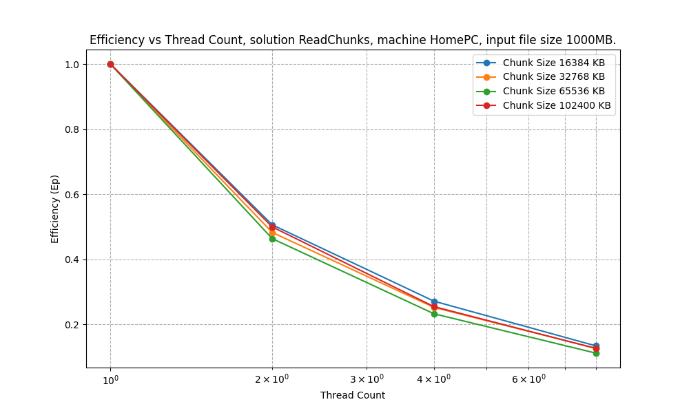


---

Резултати от решение "Изчитане на парчета" при четене на файл *10 000 MB*, машина "Home PC" (_таблица 12_):


| Chunk Size (KB) | # | p | G | Tp(1) | Tp(2) | Tp(3) | Tp(min) | Sp | Ep |
|-----------------|---|---|---|-------|-------|-------|---------|----|----|
| 32768             | 1  | 1  | 312.50 | 252404ms | 252404ms | 252404ms | 252404ms | 1.000000 | 1.000000 |
| 32768             | 2  | 2  | 312.50 | 322522ms | 322522ms | 322522ms | 322522ms | 0.782595 | 0.391297 |
| 32768             | 3  | 8  | 312.50 | 320744ms | 320744ms | 320744ms | 320744ms | 0.786933 | 0.098367 |
| 32768             | 4  | 16 | 312.50 | 245671ms | 245671ms | 245671ms | 245671ms | 1.027407 | 0.064213 |
| 126976            | 1  | 1  | 80.65 | 204815ms | 204815ms | 204815ms | 204815ms | 1.000000 | 1.000000 |
| 126976            | 2  | 2  | 80.65 | 210692ms | 210692ms | 210692ms | 210692ms | 0.972106 | 0.486053 |
| 126976            | 3  | 8  | 80.65 | 207184ms | 207184ms | 207184ms | 207184ms | 0.988566 | 0.123571 |
| 126976            | 4  | 16 | 80.65 | 220280ms | 220280ms | 220280ms | 220280ms | 0.929794 | 0.058112 |

Графика на времето от решение "Изчитане на парчета" при четене на файл *10000 MB*, машина "Home PC" (_фигура 20_):

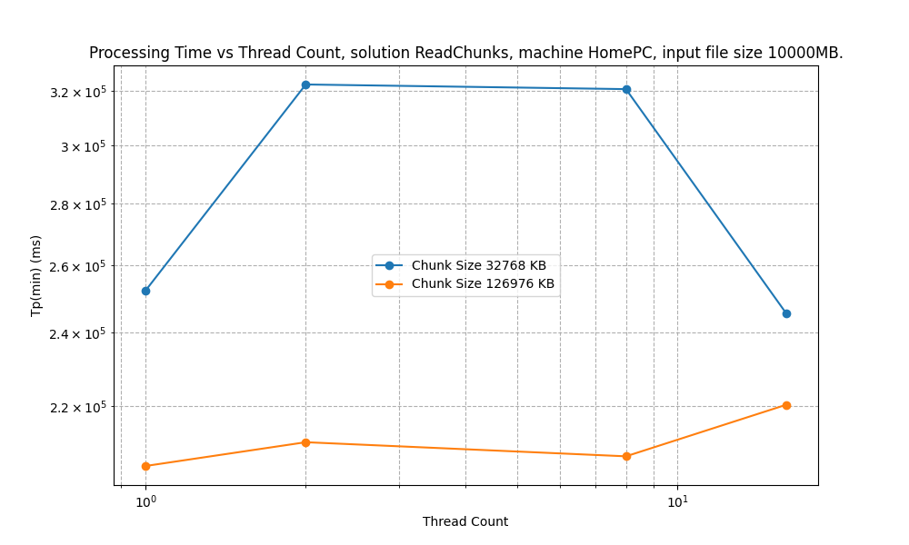


---

Резултати от решение "Изчитане на парчета" при четене на файл *300 MB*, машина "t5600 (_таблица 13_):


| Chunk Size (Bytes) | # | p | G | Tp(1) | Tp(2) | Tp(3) | Tp(min) | Sp | Ep |
|---------------------|---|---|---|-------|-------|-------|---------|----|----|
| 4096                | 1  | 1  | 76800.00 | 11179ms | 11187ms | 11204ms | 11179ms | 1.000000 | 1.000000 |
| 4096                | 2  | 2  | 76800.00 | 11598ms | 11299ms | 11318ms | 11299ms | 0.989380 | 0.494690 |
| 4096                | 3  | 8  | 76800.00 | 11592ms | 11584ms | 11564ms | 11564ms | 0.966707 | 0.120838 |
| 4096                | 4  | 16 | 76800.00 | 11641ms | 11603ms | 11591ms | 11591ms | 0.964455 | 0.060278 |
| 4096                | 5  | 32 | 76800.00 | 11626ms | 11661ms | 11585ms | 11585ms | 0.964955 | 0.030155 |
| 16384               | 1  | 1  | 19200.00 | 11116ms | 11042ms | 11032ms | 11032ms | 1.000000 | 1.000000 |
| 16384               | 2  | 2  | 19200.00 | 11175ms | 11380ms | 11103ms | 11103ms | 0.993605 | 0.496803 |
| 16384               | 3  | 8  | 19200.00 | 11121ms | 11191ms | 11174ms | 11121ms | 0.991997 | 0.124000 |
| 16384               | 4  | 16 | 19200.00 | 11114ms | 11112ms | 11154ms | 11112ms | 0.992801 | 0.062050 |
| 16384               | 5  | 32 | 19200.00 | 11102ms | 11160ms | 11128ms | 11102ms | 0.993695 | 0.031053 |
| 65536               | 1  | 1  | 4800.00 | 10967ms | 10979ms | 11034ms | 10967ms | 1.000000 | 1.000000 |
| 65536               | 2  | 2  | 4800.00 | 10962ms | 10971ms | 10946ms | 10946ms | 1.001919 | 0.500959 |
| 65536               | 3  | 8  | 4800.00 | 10943ms | 10971ms | 10982ms | 10943ms | 1.002193 | 0.125274 |
| 65536               | 4  | 16 | 4800.00 | 10915ms | 10941ms | 10929ms | 10915ms | 1.004764 | 0.062798 |
| 65536               | 5  | 32 | 4800.00 | 10969ms | 10935ms | 10975ms | 10935ms | 1.002926 | 0.031341 |
| 1048576             | 1  | 1  | 300.00 | 10964ms | 11021ms | 11042ms | 10964ms | 1.000000 | 1.000000 |
| 1048576             | 2  | 2  | 300.00 | 10996ms | 10970ms | 10978ms | 10970ms | 0.999453 | 0.499727 |
| 1048576             | 3  | 8  | 300.00 | 10952ms | 10948ms | 10974ms | 10948ms | 1.001461 | 0.125183 |
| 1048576             | 4  | 16 | 300.00 | 10957ms | 10974ms | 10954ms | 10954ms | 1.000913 | 0.062557 |
| 1048576             | 5  | 32 | 300.00 | 11000ms | 10966ms | 11005ms | 10966ms | 0.999818 | 0.031244 |
| 8388608             | 1  | 1  | 37.50 | 11036ms | 11057ms | 11069ms | 11036ms | 1.000000 | 1.000000 |
| 8388608             | 2  | 2  | 37.50 | 10996ms | 11013ms | 10974ms | 10974ms | 1.005650 | 0.502825 |
| 8388608             | 3  | 8  | 37.50 | 11042ms | 11048ms | 10980ms | 10980ms | 1.005100 | 0.125638 |
| 8388608             | 4  | 16 | 37.50 | 11086ms | 11081ms | 11087ms | 11081ms | 0.995939 | 0.062246 |
| 8388608             | 5  | 32 | 37.50 | 11158ms | 11128ms | 11160ms | 11128ms | 0.991733 | 0.030992 |

Графика на времето от решение "Изчитане на парчета" при четене на файл *300 MB*, машина "t5600" (_фигура 21_):

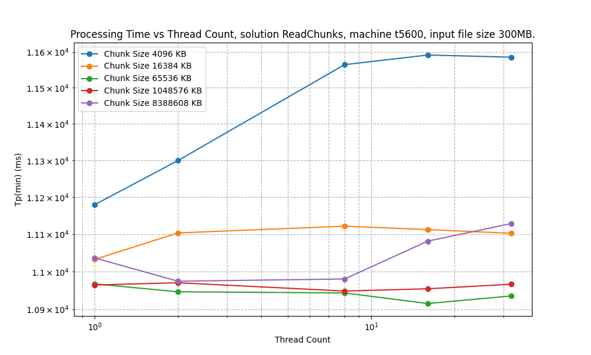

---

Резултати от решение "Изчитане на парчета" при четене на файл *1000 MB*, машина "t5600 (_таблица 14_):

| Chunk Size (Bytes) | # | p | G | Tp(1) | Tp(2) | Tp(3) | Tp(min) | Sp | Ep |
|---------------------|---|---|---|-------|-------|-------|---------|----|----|
| 4096                | 1  | 1  | 256000.00 | 37143ms | 37335ms | 37328ms | 37143ms | 1.000000 | 1.000000 |
| 4096                | 2  | 8  | 256000.00 | 38465ms | 38489ms | 38205ms | 38205ms | 0.972203 | 0.121525 |
| 4096                | 3  | 32 | 256000.00 | 38328ms | 38139ms | 38381ms | 38139ms | 0.973885 | 0.030434 |
| 1048576             | 1  | 1  | 1000.00 | 36122ms | 36202ms | 36240ms | 36122ms | 1.000000 | 1.000000 |
| 1048576             | 2  | 8  | 1000.00 | 36317ms | 36297ms | 36397ms | 36297ms | 0.995179 | 0.124397 |
| 1048576             | 3  | 32 | 1000.00 | 36319ms | 36140ms | 36441ms | 36140ms | 0.999502 | 0.031234 |
| 8388608             | 1  | 1  | 125.00 | 36486ms | 36585ms | 36969ms | 36486ms | 1.000000 | 1.000000 |
| 8388608             | 2  | 8  | 125.00 | 36362ms | 36496ms | 36290ms | 36290ms | 1.005401 | 0.125675 |
| 8388608             | 3  | 32 | 125.00 | 36565ms | 36541ms | 36480ms | 36480ms | 1.000164 | 0.031255 |
| 33554432            | 1  | 1  | 31.25 | 36990ms | 36722ms | 36877ms | 36722ms | 1.000000 | 1.000000 |
| 33554432            | 2  | 8  | 31.25 | 36925ms | 37186ms | 36867ms | 36867ms | 0.996067 | 0.124508 |
| 33554432            | 3  | 32 | 31.25 | 36631ms | 36710ms | 36852ms | 36631ms | 1.002484 | 0.031328 |
| 134217728           | 1  | 1  | 7.81  | 37362ms | 37412ms | 37391ms | 37362ms | 1.000000 | 1.000000 |
| 134217728           | 2  | 8  | 7.81  | 36432ms | 33726ms | 36239ms | 33726ms | 1.107810 | 0.138476 |
| 134217728           | 3  | 32 | 7.81  | 36432ms | 36477ms | 36252ms | 36252ms | 1.030619 | 0.032207 |

Графика на времето от решение "Изчитане на парчета" при четене на файл *1000 MB*, машина "t5600" (_фигура 22_):


### 5.4 Анализ на получените резултати

За разлика от решението "Изчитане наведнъж", където се наблюдава ускорение над 2.5 пъти, в това решение, "Изчитане на части" се постигна ускорение от едва 1.1 при подходящ обем работа на всяка нишка и големина на входните данни. При файла с големина 300 MB ускорение не се постига при разновидни обеми на работа за всяка нишка. При файла от 500 MВ, ускорение се постига при четящ прозорец 16 КВ и 51200 КВ - съответно стойности близки до големината на L1 и L3 кеша на изпълняващата машина Home PC. На сървърната машина забързвания чрез увеличаване на големината на четящия прозорец са незначими. Най-много се откроява забързването от 1.1 пъти при големина на прозореца 134,217,728 B (128 МВ) и 8 на брой нишки при файла с големина 1000 МВ.

<div class="page"/>

### 6. Заключение

Най-високо ускорение показа второто решение "Изчитане наведнъж". При работа с файлове, които могат да се заредят наведнъж в паметта на машината, оптималното решение е всяка нишка да поеме пропорционално голямо количество данни и единствено да изчислява честотата на всеки символ. Така се избягва нуждата от синхронизиране при четенето от файла. Когато обаче файла не може да бъде зареден наведнъж, добро решение е всяка нишка да чете и пресмята конкретен размер парче от входните данни. От получените резултати следва, че големината на парчето, което всяка нишка обработва следва да е пропорционално на броя нишки - всяка нишка да поеме равен товар, без да има нужда от повторно четене. 
